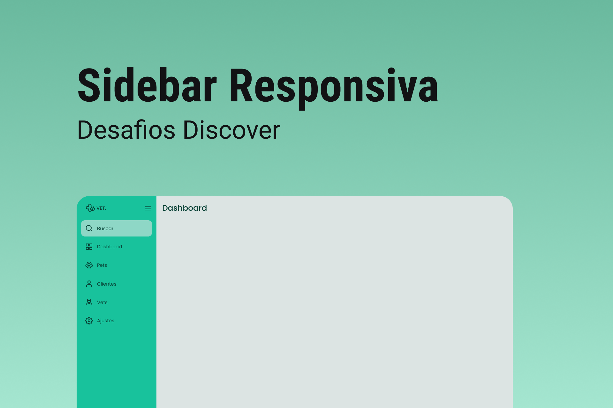

<h1 align="center">Sidebar</h1>

  Projeto retirado dos desafios do Discover, um programa de estudo gratuito e exclusivo promovido pela Rocketseat para o ensino de tecnologias web.

  <a href="#-layout">Layout</a>&nbsp;&nbsp;&nbsp;|&nbsp;&nbsp;&nbsp;
  <a href="#-aprendizado">Aprendizado</a>&nbsp;&nbsp;&nbsp;|&nbsp;&nbsp;&nbsp;
  <a href="#-projeto">Projeto</a>&nbsp;&nbsp;&nbsp;|&nbsp;&nbsp;&nbsp;
  <a href="#-tecnologias">Tecnologias</a>&nbsp;&nbsp;&nbsp;|&nbsp;&nbsp;&nbsp;
  <a href="#-licença">Licença</a>

 

  

 

  

## 🎨 Layout

Você pode visualizar o layout do projeto através [DESSE LINK](https://www.figma.com/file/iOuqAlZvhAMkkfjCMFyc7Y/DD-%2F-Sidebar-Responsiva/duplicate).

## 📖 Aprendizado

- Aprendi a metodologia CSS BEM para escrever CSS de forma mais organizada e modular;
- Aprendi a usar a nomenclatura de namespaces no CSS para evitar conflitos de nomenclatura;
- Aprimorei minhas habilidades em organizar códigos JavaScript, tornando-os mais legíveis;
- Eu aprendi conceitos de animações suaves em CSS para criar uma experiência agradável e fluida;
- Eu aprendi a utilizar JavaScript para ativar códigos específicos, os quais variam de acordo com o tamanho da página.

## 💻 Projeto

O projeto Sidebar consiste em criar uma barra lateral de navegação para uma aplicação web responsiva utilizando HTML, CSS e JavaScript. O objetivo é construir uma barra que possua funcionalidades como a abertura e fechamento automático em dispositivos móveis, ícones interativos e opções de menu. Além disso, o desafio requer a implementação de uma animação suave e fluida para o efeito de transição da barra lateral.

## 💡 Tecnologias

Esse projeto foi desenvolvido com as seguintes tecnologias:

- [HTML](https://developer.mozilla.org/pt-BR/docs/Web/HTML)
- [CSS](https://developer.mozilla.org/pt-BR/docs/Web/CSS)
- [JavaScript](https://developer.mozilla.org/pt-BR/docs/Web/JavaScript)
- [Git](https://git-scm.com)
- [Figma](https://www.figma.com)
- [ICONS8](https://icons8.com)

## 📝 Licença

Este projeto está sob a licença MIT. Consulte o arquivo [LICENSE](https://github.com/kauankarvalho/Sidebar/blob/main/LICENSE) para obter mais detalhes.
